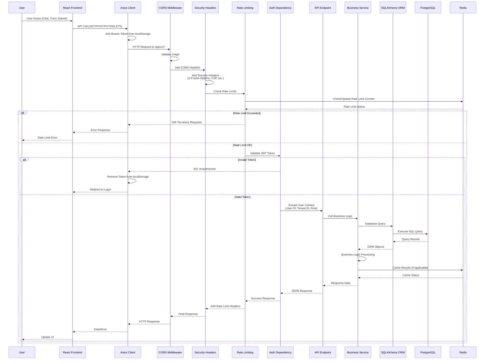
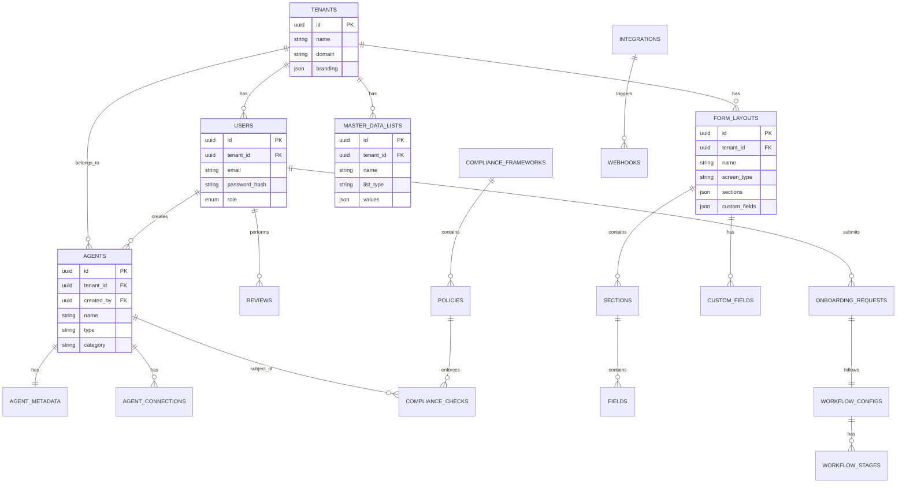
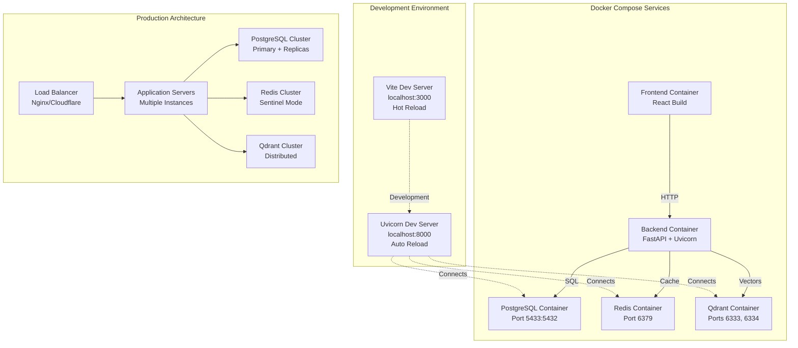
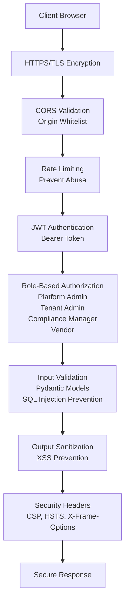

# VAKA Agent Platform - Architecture Diagram

## System Architecture Overview

This document provides a comprehensive view of the VAKA Agent Platform architecture, including technology stack, component interactions, and data flow.

## Technology Stack

### Frontend (Client Layer)
- **Framework**: React 18.2.0 with TypeScript
- **Build Tool**: Vite 5.0.7
- **State Management**: 

  - TanStack Query (React Query) v5.12.2 for server state
  - Zustand v4.4.7 for client state
- **UI Libraries**:
  - TailwindCSS 3.3.6 for styling
  - React Router DOM v6.20.0 for routing
  - React Hook Form v7.48.2 for form management
  - React Quill v2.0.0 for rich text editing
- **HTTP Client**: Axios v1.6.2
- **Drag & Drop**: @dnd-kit/core v6.3.1
- **Charts**: Recharts v3.5.1

### Backend (Server Layer)
- **Framework**: FastAPI (Python 3.11+)
- **ASGI Server**: Uvicorn
- **ORM**: SQLAlchemy 2.x
- **Database Migrations**: Alembic
- **Authentication**: OAuth2 with JWT tokens
- **API Documentation**: OpenAPI/Swagger (auto-generated)

### Data Layer
- **Primary Database**: PostgreSQL 15 (Alpine)
- **Caching**: Redis 7 (Alpine)
- **Vector Database**: Qdrant (for RAG capabilities)

### Infrastructure
- **Containerization**: Docker & Docker Compose
- **Development**: Hot reload enabled for both frontend and backend

---

## Architecture Diagram

```mermaid
graph TB
    subgraph "Client Layer (Frontend)"
        UI[React SPA<br/>Port 3000]
        UI -->|HTTP/HTTPS| API_CLIENT[Axios Client<br/>with Interceptors]
        API_CLIENT -->|Bearer Token<br/>JWT| MIDDLEWARE
    end

    subgraph "Middleware Layer"
        MIDDLEWARE[CORS Middleware]
        MIDDLEWARE --> SEC_HEADERS[Security Headers<br/>Middleware]
        SEC_HEADERS --> RATE_LIMIT[Rate Limiting<br/>Middleware]
        RATE_LIMIT --> METRICS_MW[Metrics Middleware]
        METRICS_MW --> AUTH_CHECK[Authentication<br/>Dependency]
    end

    subgraph "API Layer (FastAPI)"
        AUTH_CHECK --> ROUTER[API Router<br/>/api/v1/*]
        
        ROUTER --> AUTH_API[/auth<br/>Login, Register, MFA]
        ROUTER --> AGENTS_API[/agents<br/>CRUD Operations]
        ROUTER --> COMPLIANCE_API[/compliance<br/>Frameworks, Policies]
        ROUTER --> REVIEWS_API[/reviews<br/>Review Management]
        ROUTER --> ONBOARDING_API[/onboarding<br/>Workflow Management]
        ROUTER --> WORKFLOW_API[/workflow_config<br/>Workflow Engine]
        ROUTER --> FORM_API[/form_layouts<br/>Form Designer]
        ROUTER --> MASTER_DATA_API[/master_data_lists<br/>Master Data]
        ROUTER --> INTEGRATIONS_API[/integrations<br/>External Integrations]
        ROUTER --> WEBHOOKS_API[/webhooks<br/>Event Notifications]
        ROUTER --> ANALYTICS_API[/analytics<br/>Business Intelligence]
        ROUTER --> OTHER_APIS[40+ Other Endpoints...]
    end

    subgraph "Service Layer (Business Logic)"
        AUTH_API --> AUTH_SVC[Auth Service<br/>JWT, Password Hashing]
        AGENTS_API --> AGENT_SVC[Agent Service<br/>Business Logic]
        COMPLIANCE_API --> COMPLIANCE_SVC[Compliance Service<br/>Framework Matching]
        REVIEWS_API --> REVIEW_SVC[Review Service]
        ONBOARDING_API --> ONBOARDING_SVC[Onboarding Service<br/>Workflow Orchestration]
        WORKFLOW_API --> WORKFLOW_SVC[Workflow Service<br/>State Machine]
        FORM_API --> FORM_SVC[Form Layout Service]
        MASTER_DATA_API --> MASTER_DATA_SVC[Master Data Service]
        INTEGRATIONS_API --> INTEGRATION_SVC[Integration Service<br/>Jira, Slack, Teams]
        WEBHOOKS_API --> WEBHOOK_SVC[Webhook Service<br/>Event Delivery]
        ANALYTICS_API --> ANALYTICS_SVC[Analytics Service<br/>Predictive Models]
        
        COMPLIANCE_SVC --> RAG_SVC[RAG Service<br/>Document Processing]
        RAG_SVC --> EMBEDDING_SVC[Embedding Service<br/>Vector Generation]
    end

    subgraph "Data Access Layer"
        AUTH_SVC --> ORM[SQLAlchemy ORM]
        AGENT_SVC --> ORM
        COMPLIANCE_SVC --> ORM
        REVIEW_SVC --> ORM
        ONBOARDING_SVC --> ORM
        WORKFLOW_SVC --> ORM
        FORM_SVC --> ORM
        MASTER_DATA_SVC --> ORM
        INTEGRATION_SVC --> ORM
        WEBHOOK_SVC --> ORM
        ANALYTICS_SVC --> ORM
        
        ORM --> DB_POOL[Connection Pool<br/>Pool Size: 10<br/>Max Overflow: 20]
        DB_POOL --> POSTGRES[(PostgreSQL 15<br/>Primary Database)]
        
        EMBEDDING_SVC --> QDRANT[(Qdrant<br/>Vector Database<br/>Port 6333)]
        
        RATE_LIMIT --> REDIS[(Redis 7<br/>Cache & Rate Limiting<br/>Port 6379)]
        AUTH_SVC --> REDIS
        WEBHOOK_SVC --> REDIS
    end

    subgraph "External Services"
        INTEGRATION_SVC --> JIRA[Jira API]
        INTEGRATION_SVC --> SLACK[Slack API]
        INTEGRATION_SVC --> TEAMS[Microsoft Teams API]
        INTEGRATION_SVC --> SERVICENOW[ServiceNow API]
        
        WEBHOOK_SVC --> EXTERNAL_WEBHOOKS[External Webhooks<br/>Customer Systems]
        
        AUTH_SVC --> SSO_PROVIDERS[SSO Providers<br/>SAML, OAuth2]
    end

    style UI fill:#e1f5ff
    style MIDDLEWARE fill:#fff4e1
    style ROUTER fill:#ffe1f5
    style ORM fill:#e1ffe1
    style POSTGRES fill:#e1e1ff
    style REDIS fill:#ffe1e1
    style QDRANT fill:#f5e1ff
```

---

## Request Flow Diagram



---

## Data Flow Diagram

```mermaid
graph LR
    subgraph "Frontend State Management"
        REACT_QUERY[TanStack Query<br/>Server State Cache]
        ZUSTAND[Zustand Store<br/>Client State]
        LOCAL_STORAGE[localStorage<br/>Auth Tokens]
    end

    subgraph "API Communication"
        AXIOS[Axios Instance<br/>Base URL: /api/v1]
        INTERCEPTORS[Request/Response<br/>Interceptors]
    end

    subgraph "Backend Processing"
        MIDDLEWARE_STACK[Middleware Stack<br/>CORS → Security → Rate Limit → Metrics]
        API_ROUTERS[40+ API Routers<br/>Modular Endpoints]
        SERVICES[Business Services<br/>Domain Logic]
    end

    subgraph "Data Persistence"
        SQLALCHEMY[SQLAlchemy ORM<br/>Connection Pooling]
        POSTGRES[(PostgreSQL<br/>Relational Data)]
        REDIS_CACHE[(Redis<br/>Cache & Sessions)]
        QDRANT_VECTOR[(Qdrant<br/>Vector Embeddings)]
    end

    REACT_QUERY -->|Query/Mutation| AXIOS
    ZUSTAND -->|State Updates| REACT_QUERY
    LOCAL_STORAGE -->|Auth Token| INTERCEPTORS
    
    AXIOS -->|HTTP Request| INTERCEPTORS
    INTERCEPTORS -->|Add Headers| MIDDLEWARE_STACK
    
    MIDDLEWARE_STACK -->|Processed Request| API_ROUTERS
    API_ROUTERS -->|Route to Handler| SERVICES
    
    SERVICES -->|ORM Queries| SQLALCHEMY
    SQLALCHEMY -->|SQL| POSTGRES
    SQLALCHEMY -->|Cache Lookup| REDIS_CACHE
    SERVICES -->|Vector Search| QDRANT_VECTOR
    
    POSTGRES -->|Results| SQLALCHEMY
    REDIS_CACHE -->|Cached Data| SQLALCHEMY
    QDRANT_VECTOR -->|Similarity Results| SERVICES
    
    SQLALCHEMY -->|ORM Objects| SERVICES
    SERVICES -->|Response| API_ROUTERS
    API_ROUTERS -->|JSON Response| MIDDLEWARE_STACK
    MIDDLEWARE_STACK -->|Add Headers| INTERCEPTORS
    INTERCEPTORS -->|Response Data| AXIOS
    AXIOS -->|Update Cache| REACT_QUERY
    REACT_QUERY -->|Re-render| REACT_QUERY
```



---

## Component Interaction Diagram

```mermaid
graph TB
    subgraph "Frontend Components"
        PAGES[Pages<br/>AgentSubmission<br/>FormDesigner<br/>Dashboard]
        COMPONENTS[Components<br/>Layout<br/>Forms<br/>Charts]
        HOOKS[Custom Hooks<br/>useAuth<br/>useQuery]
        LIB[API Libraries<br/>agents.ts<br/>formLayouts.ts<br/>auth.ts]
    end

    subgraph "Backend API Endpoints"
        AUTH_ENDPOINT[/auth<br/>POST /login<br/>GET /me]
        AGENTS_ENDPOINT[/agents<br/>CRUD Operations]
        FORMS_ENDPOINT[/form-layouts<br/>Designer API]
        MASTER_DATA_ENDPOINT[/master-data-lists<br/>Master Data API]
    end

    subgraph "Backend Services"
        AUTH_SERVICE[AuthService<br/>verify_password<br/>create_access_token]
        AGENT_SERVICE[AgentService<br/>Business Logic]
        FORM_SERVICE[FormLayoutService<br/>Layout Management]
        RAG_SERVICE[RAGService<br/>Document Processing]
        INTEGRATION_SERVICE[IntegrationService<br/>External APIs]
    end

    subgraph "Database Models"
        USER_MODEL[User Model]
        AGENT_MODEL[Agent Model]
        FORM_MODEL[FormLayout Model]
        MASTER_DATA_MODEL[MasterDataList Model]
        TENANT_MODEL[Tenant Model]
    end

    PAGES --> COMPONENTS
    COMPONENTS --> HOOKS
    HOOKS --> LIB
    LIB -->|HTTP| AUTH_ENDPOINT
    LIB -->|HTTP| AGENTS_ENDPOINT
    LIB -->|HTTP| FORMS_ENDPOINT
    LIB -->|HTTP| MASTER_DATA_ENDPOINT
    
    AUTH_ENDPOINT --> AUTH_SERVICE
    AGENTS_ENDPOINT --> AGENT_SERVICE
    FORMS_ENDPOINT --> FORM_SERVICE
    MASTER_DATA_ENDPOINT --> FORM_SERVICE
    
    AUTH_SERVICE --> USER_MODEL
    AGENT_SERVICE --> AGENT_MODEL
    FORM_SERVICE --> FORM_MODEL
    FORM_SERVICE --> MASTER_DATA_MODEL
    AUTH_SERVICE --> TENANT_MODEL
    
    AGENT_SERVICE --> RAG_SERVICE
    AGENT_SERVICE --> INTEGRATION_SERVICE
```

---

## Middleware Stack Details

```mermaid
graph TD
    REQUEST[Incoming HTTP Request] --> CORS[CORS Middleware<br/>- Validate Origin<br/>- Add CORS Headers<br/>- Handle Preflight]
    
    CORS --> SECURITY[Security Headers Middleware<br/>- X-Frame-Options: DENY<br/>- X-Content-Type-Options: nosniff<br/>- CSP Headers<br/>- HSTS (HTTPS only)]
    
    SECURITY --> RATE_LIMIT[Rate Limiting Middleware<br/>- Redis-based counting<br/>- Fallback to in-memory<br/>- 60 req/min (prod)<br/>- 300 req/min (dev)]
    
    RATE_LIMIT --> METRICS[Metrics Middleware<br/>- Request timing<br/>- Status code tracking<br/>- Performance metrics]
    
    METRICS --> AUTH[Authentication Dependency<br/>- Extract JWT token<br/>- Validate token<br/>- Load user context<br/>- Check permissions]
    
    AUTH --> ROUTER[API Router<br/>Route to endpoint]
    
    ROUTER --> HANDLER[Request Handler<br/>Business Logic]
    
    HANDLER --> RESPONSE[HTTP Response]
    
    RESPONSE --> METRICS
    METRICS --> RATE_LIMIT
    RATE_LIMIT --> SECURITY
    SECURITY --> CORS
    CORS --> CLIENT[Response to Client]
```

---

## Database Schema Overview



---

## Deployment Architecture



---

## Key Architectural Patterns

### 1. **Layered Architecture**
- **Presentation Layer**: React frontend with component-based UI
- **API Layer**: RESTful API endpoints with FastAPI
- **Service Layer**: Business logic separation
- **Data Access Layer**: SQLAlchemy ORM with connection pooling

### 2. **Middleware Pattern**
- Request processing pipeline with multiple middleware layers
- Each middleware handles a specific concern (CORS, security, rate limiting)

### 3. **Dependency Injection**
- FastAPI's dependency system for authentication and database sessions
- Clean separation of concerns

### 4. **Repository Pattern (via ORM)**
- SQLAlchemy models act as repositories
- Services interact with models, not raw SQL

### 5. **Caching Strategy**
- Redis for session storage and rate limiting
- Query result caching for frequently accessed data

### 6. **Multi-tenancy**
- Tenant isolation at database level
- Tenant context passed through request chain

### 7. **Event-Driven Architecture**
- Webhook system for external integrations
- Event logging for audit trails

---

## Security Architecture



---

## Performance Optimizations

1. **Connection Pooling**: SQLAlchemy connection pool (10 base, 20 overflow)
2. **Query Optimization**: Eager loading, select_related for relationships
3. **Caching**: Redis for frequently accessed data
4. **Lazy Loading**: React code splitting with Vite
5. **Request Batching**: TanStack Query for efficient data fetching
6. **Database Indexing**: Indexes on foreign keys and frequently queried columns
7. **Vector Search**: Qdrant for fast similarity searches

---

## Integration Points

1. **External APIs**: Jira, Slack, Microsoft Teams, ServiceNow
2. **SSO Providers**: SAML 2.0, OAuth2
3. **Webhooks**: Outbound webhooks to customer systems
4. **SCIM**: User provisioning via SCIM 2.0
5. **Email**: SMTP for notifications

---

## Monitoring & Observability

- **Logging**: Structured logging with Python logging module
- **Metrics**: Custom metrics middleware for request tracking
- **Health Checks**: `/health` endpoint for service status
- **Error Tracking**: Exception handlers with detailed error logging
- **Audit Trails**: Comprehensive audit logging for compliance

---

## Summary

The VAKA Agent Platform follows a modern, scalable architecture with:

- **Frontend**: React SPA with TypeScript, using TanStack Query for server state management
- **Backend**: FastAPI with modular API routers and service layer
- **Database**: PostgreSQL for relational data, Redis for caching, Qdrant for vector search
- **Security**: Multi-layer security with JWT auth, rate limiting, and security headers
- **Scalability**: Connection pooling, caching, and horizontal scaling support
- **Maintainability**: Clean separation of concerns, dependency injection, and modular design

This architecture supports multi-tenancy, complex workflows, compliance management, and integrations with external systems while maintaining security and performance.
