# VAKA Platform Architecture & Entity Relationship Diagrams

This document provides comprehensive architecture and entity relationship diagrams to help developers understand how the platform works.

## Table of Contents
1. [Full Stack Architecture Diagram](#full-stack-architecture-diagram)
2. [Entity Relationship Diagram](#entity-relationship-diagram)
3. [Key Components Overview](#key-components-overview)

---

## Full Stack Architecture Diagram

```mermaid
graph TB
    subgraph "Client Layer - Frontend (React/TypeScript)"
        UI[React SPA<br/>Port 3000<br/>TypeScript]
        UI -->|React Router| ROUTES[Route Components<br/>60+ Pages]
        UI -->|React Query| STATE[State Management<br/>@tanstack/react-query]
        UI -->|Axios| API_CLIENT[API Client<br/>with Interceptors]
        
        ROUTES --> PAGES[Key Pages:<br/>- Dashboard<br/>- AgentCatalog<br/>- Assessments<br/>- WorkflowManagement<br/>- FormDesigner<br/>- Studio<br/>- Analytics]
        
        STATE --> CACHE[Query Cache<br/>Stale Time Management]
        API_CLIENT -->|Bearer JWT Token| MIDDLEWARE
    end

    subgraph "API Gateway & Middleware Layer"
        MIDDLEWARE[CORS Middleware]
        MIDDLEWARE --> SEC_HEADERS[Security Headers<br/>X-Frame-Options, CSP]
        SEC_HEADERS --> RATE_LIMIT[Rate Limiting<br/>Middleware]
        RATE_LIMIT --> METRICS_MW[Metrics Middleware<br/>Request Tracking]
        METRICS_MW --> AUTH_CHECK[Authentication<br/>Dependency<br/>JWT Validation]
        AUTH_CHECK --> TENANT_RESOLVE[Tenant Resolution<br/>Multi-tenant Isolation]
    end

    subgraph "API Layer - FastAPI (Python)"
        TENANT_RESOLVE --> ROUTER[API Router<br/>/api/v1/*]
        
        ROUTER --> AUTH_API[/auth<br/>Login, Register, MFA, SSO]
        ROUTER --> USERS_API[/users<br/>User Management]
        ROUTER --> TENANTS_API[/tenants<br/>Tenant Management]
        ROUTER --> AGENTS_API[/agents<br/>Agent CRUD Operations]
        ROUTER --> VENDORS_API[/vendors<br/>Vendor Management]
        ROUTER --> ASSESSMENTS_API[/assessments<br/>Assessment Management]
        ROUTER --> WORKFLOW_API[/workflow<br/>Workflow Orchestration]
        ROUTER --> COMPLIANCE_API[/compliance<br/>Frameworks, Policies]
        ROUTER --> REVIEWS_API[/reviews<br/>Review Management]
        ROUTER --> INTEGRATIONS_API[/integrations<br/>External Integrations]
        ROUTER --> WEBHOOKS_API[/webhooks<br/>Event Notifications]
        ROUTER --> ANALYTICS_API[/analytics<br/>Business Intelligence]
        ROUTER --> PRESENTATION_API[/presentation<br/>Business Pages & Widgets]
        ROUTER --> STUDIO_API[/studio<br/>Agentic Flow Builder]
        ROUTER --> FORMS_API[/form_layouts<br/>Form Designer]
        ROUTER --> MASTER_DATA_API[/master_data_lists<br/>Master Data Management]
        ROUTER --> OTHER_APIS[30+ Other Endpoints<br/>- Custom Fields<br/>- Entity Fields<br/>- Role Permissions<br/>- Tickets<br/>- Messages<br/>- Export]
    end

    subgraph "Service Layer - Business Logic"
        AUTH_API --> AUTH_SVC[Auth Service<br/>JWT, Password Hashing<br/>MFA, SSO]
        USERS_API --> USER_SVC[User Service<br/>User Management<br/>Role Assignment]
        TENANTS_API --> TENANT_SVC[Tenant Service<br/>Multi-tenant Isolation<br/>Feature Flags]
        AGENTS_API --> AGENT_SVC[Agent Service<br/>Business Logic<br/>Status Management]
        VENDORS_API --> VENDOR_SVC[Vendor Service<br/>Vendor Matching<br/>Invitations]
        ASSESSMENTS_API --> ASSESSMENT_SVC[Assessment Service<br/>TPRM, Risk Assessment<br/>Scheduling]
        WORKFLOW_API --> WORKFLOW_SVC[Workflow Service<br/>State Machine<br/>Orchestration]
        COMPLIANCE_API --> COMPLIANCE_SVC[Compliance Service<br/>Framework Matching<br/>Policy Enforcement]
        REVIEWS_API --> REVIEW_SVC[Review Service<br/>Review Assignment<br/>Decision Tracking]
        INTEGRATIONS_API --> INTEGRATION_SVC[Integration Service<br/>SMTP, SSO, Webhooks<br/>Jira, Slack, Teams]
        WEBHOOKS_API --> WEBHOOK_SVC[Webhook Service<br/>Event Delivery<br/>Retry Logic]
        ANALYTICS_API --> ANALYTICS_SVC[Analytics Service<br/>Predictive Models<br/>Ecosystem Mapping]
        PRESENTATION_API --> PRESENTATION_SVC[Presentation Service<br/>Page & Widget Management<br/>Data Aggregation]
        STUDIO_API --> STUDIO_SVC[Studio Service<br/>Agentic Flow Builder<br/>Flow Execution]
        FORMS_API --> FORM_SVC[Form Layout Service<br/>Dynamic Form Generation<br/>Field Access Control]
        MASTER_DATA_API --> MASTER_DATA_SVC[Master Data Service<br/>Data List Management<br/>Tenant Isolation]
        
        COMPLIANCE_SVC --> RAG_SVC[RAG Service<br/>Document Processing<br/>Knowledge Retrieval]
        RAG_SVC --> EMBEDDING_SVC[Embedding Service<br/>Vector Generation<br/>OpenAI/Anthropic]
        
        ASSESSMENT_SVC --> RULE_ENGINE[Business Rules Engine<br/>Rule Evaluation<br/>Auto-assignment]
        WORKFLOW_SVC --> REMINDER_SVC[Reminder Service<br/>Workflow Reminders<br/>Email Notifications]
        
        STUDIO_SVC --> AGENTIC_SVC[Agentic Agent Service<br/>AI Agent Registry<br/>MCP Connections]
        AGENTIC_SVC --> LEARNING_SVC[Learning System<br/>Cross-tenant Learning<br/>Knowledge Base]
    end

    subgraph "Data Access Layer"
        AUTH_SVC --> ORM[SQLAlchemy ORM<br/>Type-safe Queries]
        USER_SVC --> ORM
        TENANT_SVC --> ORM
        AGENT_SVC --> ORM
        VENDOR_SVC --> ORM
        ASSESSMENT_SVC --> ORM
        WORKFLOW_SVC --> ORM
        COMPLIANCE_SVC --> ORM
        REVIEW_SVC --> ORM
        INTEGRATION_SVC --> ORM
        WEBHOOK_SVC --> ORM
        ANALYTICS_SVC --> ORM
        PRESENTATION_SVC --> ORM
        STUDIO_SVC --> ORM
        FORM_SVC --> ORM
        MASTER_DATA_SVC --> ORM
        
        ORM --> DB_POOL[Connection Pool<br/>Pool Size: 10<br/>Max Overflow: 20]
        DB_POOL --> POSTGRES[(PostgreSQL 15<br/>Primary Database<br/>Multi-tenant Data)]
        
        EMBEDDING_SVC --> QDRANT[(Qdrant<br/>Vector Database<br/>Port 6333<br/>RAG Storage)]
        
        RATE_LIMIT --> REDIS[(Redis 7<br/>Cache & Rate Limiting<br/>Port 6379<br/>Session Storage)]
        AUTH_SVC --> REDIS
        WEBHOOK_SVC --> REDIS
        REMINDER_SVC --> REDIS
    end

    subgraph "External Services & Integrations"
        INTEGRATION_SVC --> SMTP[SMTP Server<br/>Email Delivery]
        INTEGRATION_SVC --> SSO_PROVIDER[SSO Providers<br/>SAML, OAuth2]
        INTEGRATION_SVC --> JIRA[Jira API<br/>Issue Tracking]
        INTEGRATION_SVC --> SLACK[Slack API<br/>Notifications]
        INTEGRATION_SVC --> TEAMS[Microsoft Teams<br/>Notifications]
        INTEGRATION_SVC --> SERVICENOW[ServiceNow API<br/>ITSM Integration]
        
        EMBEDDING_SVC --> OPENAI[OpenAI API<br/>Embeddings & LLM]
        EMBEDDING_SVC --> ANTHROPIC[Anthropic API<br/>Claude LLM]
        
        AGENTIC_SVC --> MCP_SERVERS[MCP Servers<br/>Model Context Protocol<br/>External Agents]
        
        WEBHOOK_SVC --> WEBHOOK_ENDPOINTS[External Webhooks<br/>Event Delivery]
    end

    subgraph "Background Jobs & Schedulers"
        ASSESSMENT_SVC --> SCHEDULER[Assessment Scheduler<br/>Cron Jobs<br/>Recurring Assessments]
        REMINDER_SVC --> REMINDER_JOB[Reminder Jobs<br/>Workflow Reminders]
        SECURITY_SVC[Security Service<br/>CVE Scanning<br/>Incident Tracking] --> SECURITY_JOB[Security Monitoring<br/>Scheduled Scans]
    end

    style UI fill:#e1f5ff
    style POSTGRES fill:#c8e6c9
    style QDRANT fill:#fff9c4
    style REDIS fill:#ffccbc
    style ORM fill:#f3e5f5
    style ROUTER fill:#e8f5e9
```

---

## Entity Relationship Diagram

```mermaid
erDiagram
    %% Core Multi-Tenant Foundation
    TENANT ||--o{ USER : "has"
    TENANT ||--o{ VENDOR : "has"
    TENANT ||--o{ MASTER_DATA_LIST : "has"
    TENANT ||--o{ ASSESSMENT : "has"
    TENANT ||--o{ INTEGRATION : "has"
    TENANT ||--o{ FORM : "has"
    TENANT ||--o{ BUSINESS_PAGE : "has"
    TENANT ||--o{ CUSTOM_FIELD_CATALOG : "has"
    TENANT ||--o{ ENTITY_FIELD_REGISTRY : "has"
    
    %% User Management
    USER ||--o{ REVIEW : "assigned_to"
    USER ||--o{ ASSESSMENT : "owns"
    USER ||--o{ ASSESSMENT_ASSIGNMENT : "assigned_to"
    USER ||--o{ ACTION_ITEM : "assigned_to"
    USER ||--o{ TICKET : "created_by"
    USER ||--o{ MESSAGE : "sender"
    USER ||--o{ AUDIT_LOG : "performed_by"
    USER ||--o{ ROLE_PERMISSION : "has"
    
    %% Vendor & Agent Hierarchy
    VENDOR ||--o{ AGENT : "owns"
    VENDOR ||--o{ VENDOR_INVITATION : "has"
    VENDOR ||--o{ VENDOR_SUBSCRIPTION : "has"
    VENDOR ||--o{ WEBHOOK : "has"
    VENDOR ||--o{ ASSESSMENT_ASSIGNMENT : "assigned_to"
    
    AGENT ||--o{ AGENT_METADATA : "has"
    AGENT ||--o{ AGENT_ARTIFACT : "has"
    AGENT ||--o{ AGENT_CONNECTION : "connects"
    AGENT ||--o{ REVIEW : "reviewed"
    AGENT ||--o{ COMPLIANCE_CHECK : "checked"
    AGENT ||--o{ RISK_ASSESSMENT : "assessed"
    AGENT ||--o{ ASSESSMENT_ASSIGNMENT : "assigned_to"
    AGENT ||--o{ TICKET : "related_to"
    AGENT ||--o{ OFFBOARDING_REQUEST : "offboarded"
    AGENT ||--o{ AGENT_ADOPTION : "adopted"
    
    %% Assessment System
    ASSESSMENT ||--o{ ASSESSMENT_QUESTION : "contains"
    ASSESSMENT ||--o{ ASSESSMENT_SCHEDULE : "scheduled"
    ASSESSMENT ||--o{ ASSESSMENT_ASSIGNMENT : "assigned"
    ASSESSMENT ||--o{ ASSESSMENT_TEMPLATE : "uses"
    ASSESSMENT ||--o{ ASSESSMENT_WORKFLOW_HISTORY : "tracks"
    ASSESSMENT ||--o{ ASSESSMENT_REVIEW : "reviewed"
    ASSESSMENT ||--o{ ASSESSMENT_RULE : "has_rules"
    
    ASSESSMENT_TEMPLATE ||--o{ ASSESSMENT : "generates"
    ASSESSMENT_TEMPLATE }o--o{ SUBMISSION_REQUIREMENT : "references"
    
    ASSESSMENT_ASSIGNMENT ||--|| VENDOR : "assigned_to"
    ASSESSMENT_ASSIGNMENT ||--|| AGENT : "assigned_to"
    ASSESSMENT_ASSIGNMENT ||--|| USER : "assigned_to"
    ASSESSMENT_ASSIGNMENT ||--|| ASSESSMENT : "belongs_to"
    
    SUBMISSION_REQUIREMENT ||--o{ REQUIREMENT_QUESTION : "has"
    SUBMISSION_REQUIREMENT ||--o{ COMPLIANCE_FRAMEWORK : "maps_to"
    
    QUESTION_LIBRARY ||--o{ ASSESSMENT_QUESTION : "references"
    QUESTION_LIBRARY ||--o{ REQUIREMENT_QUESTION : "references"
    
    %% Workflow System
    WORKFLOW_CONFIG ||--o{ WORKFLOW_STAGE : "has_stages"
    WORKFLOW_STAGE ||--o{ WORKFLOW_STAGE_ACTION : "has_actions"
    WORKFLOW_STAGE ||--o{ WORKFLOW_REMINDER : "has_reminders"
    WORKFLOW_STAGE ||--o{ WORKFLOW_AUDIT_TRAIL : "tracks"
    
    WORKFLOW_CONFIG ||--o{ ASSESSMENT_WORKFLOW_HISTORY : "executes"
    WORKFLOW_CONFIG ||--o{ APPROVAL_INSTANCE : "instantiates"
    
    APPROVAL_INSTANCE ||--o{ APPROVAL_STEP : "has_steps"
    APPROVAL_INSTANCE ||--|| AGENT : "approves"
    
    %% Compliance & Review System
    COMPLIANCE_FRAMEWORK ||--o{ COMPLIANCE_CHECK : "validates"
    COMPLIANCE_FRAMEWORK ||--o{ SUBMISSION_REQUIREMENT : "requires"
    
    REVIEW ||--o{ REVIEW_COMMENT : "has"
    REVIEW ||--o{ REVIEW_DECISION : "makes"
    REVIEW ||--|| WORKFLOW_STAGE : "belongs_to"
    
    COMPLIANCE_CHECK ||--|| COMPLIANCE_FRAMEWORK : "validates_against"
    COMPLIANCE_CHECK ||--|| AGENT : "checks"
    
    RISK_ASSESSMENT ||--|| AGENT : "assesses"
    
    %% Knowledge Base & RAG
    KNOWLEDGE_DOCUMENT ||--o{ DOCUMENT_CHUNK : "chunked_into"
    DOCUMENT_CHUNK ||--o{ RAG_QUERY : "retrieved_by"
    KNOWLEDGE_DOCUMENT ||--o{ AI_RECOMMENDATION : "sources"
    
    %% Integration System
    INTEGRATION ||--o{ WEBHOOK_DELIVERY : "delivers"
    INTEGRATION ||--|| TENANT : "configured_for"
    
    WEBHOOK ||--o{ WEBHOOK_DELIVERY : "delivers"
    WEBHOOK ||--|| VENDOR : "belongs_to"
    
    %% Presentation Layer
    BUSINESS_PAGE ||--o{ PAGE_WIDGET : "contains"
    PAGE_WIDGET ||--|| WIDGET : "instantiates"
    WIDGET ||--o{ WIDGET_DATA_CACHE : "caches"
    
    %% Form Designer
    FORM ||--o{ CUSTOM_FIELD_CATALOG : "references"
    FORM_LAYOUT ||--o{ CUSTOM_FIELD_CATALOG : "uses"
    FORM_LAYOUT ||--|| FORM_TYPE : "has_type"
    
    %% Custom Fields & Entity Management
    CUSTOM_FIELD_CATALOG ||--|| TENANT : "belongs_to"
    ENTITY_FIELD_REGISTRY ||--|| TENANT : "belongs_to"
    
    %% Agentic AI System
    AGENTIC_AGENT ||--o{ AGENT_SKILL : "has"
    AGENTIC_AGENT ||--o{ AGENTIC_AGENT_SESSION : "has"
    AGENTIC_AGENT ||--o{ AGENTIC_AGENT_INTERACTION : "tracks"
    AGENTIC_AGENT ||--o{ AGENTIC_AGENT_LEARNING : "learns"
    AGENTIC_AGENT ||--o{ MCP_CONNECTION : "connects"
    
    AGENTIC_FLOW ||--o{ FLOW_EXECUTION : "executes"
    FLOW_EXECUTION ||--o{ FLOW_NODE_EXECUTION : "has_nodes"
    AGENTIC_FLOW ||--o{ STUDIO_AGENT : "contains"
    
    %% Business Rules & Configuration
    BUSINESS_RULE ||--o{ ASSESSMENT_RULE : "extends"
    ASSESSMENT_RULE ||--|| ASSESSMENT : "applies_to"
    
    ROLE_CONFIGURATION ||--o{ ROLE_PERMISSION : "defines"
    ROLE_PERMISSION ||--|| USER : "grants"
    
    %% Security & Monitoring
    SECURITY_INCIDENT ||--o{ CVE_TRACKING : "tracks"
    SECURITY_INCIDENT ||--|| AGENT : "affects"
    
    %% Audit & Logging
    AUDIT_LOG ||--|| USER : "performed_by"
    
    %% Entity Definitions
    TENANT {
        uuid id PK
        string name
        string slug UK
        string status
        string license_tier
        json license_features
        json settings
        json custom_branding
        string industry
    }
    
    USER {
        uuid id PK
        string email UK
        string name
        enum role
        uuid tenant_id FK
        string hashed_password
        boolean is_active
    }
    
    VENDOR {
        uuid id PK
        uuid tenant_id FK
        string name
        string contact_email
        string status
    }
    
    AGENT {
        uuid id PK
        uuid vendor_id FK
        string name
        string type
        string status
        integer compliance_score
        integer risk_score
    }
    
    ASSESSMENT {
        uuid id PK
        uuid tenant_id FK
        uuid owner_id FK
        string assessment_id UK
        string name
        string assessment_type
        string status
        json assignment_rules
    }
    
    ASSESSMENT_ASSIGNMENT {
        uuid id PK
        uuid assessment_id FK
        uuid vendor_id FK
        uuid agent_id FK
        uuid assigned_to_id FK
        string status
    }
    
    WORKFLOW_CONFIG {
        uuid id PK
        string entity_name
        string request_type
        json workflow_config
    }
    
    WORKFLOW_STAGE {
        uuid id PK
        uuid workflow_config_id FK
        string stage_name
        integer order_index
    }
    
    INTEGRATION {
        uuid id PK
        uuid tenant_id FK
        string integration_type
        json configuration
        boolean is_active
    }
    
    AGENTIC_AGENT {
        uuid id PK
        string name
        string agent_type
        string status
        json configuration
    }
    
    AGENTIC_FLOW {
        uuid id PK
        string name
        json flow_definition
        string status
    }
```



---

## Key Components Overview

### Frontend Architecture

**Technology Stack:**
- **Framework**: React 18+ with TypeScript
- **State Management**: React Query (@tanstack/react-query) for server state
- **Routing**: React Router v6
- **HTTP Client**: Axios with interceptors
- **UI Components**: Custom Material Design-inspired components
- **Forms**: Dynamic form generation with field-level access control

**Key Frontend Components:**
1. **Pages** (60+ pages):
   - Dashboard, Analytics, Agent Catalog
   - Assessment Management, Submission, Approver interfaces
   - Workflow Management, Form Designer
   - Studio (Agentic Flow Builder)
   - Integration Management, Webhook Management
   - Role Permissions, Custom Fields, Entity Fields
   - Master Data Management, Suppliers Master View

2. **State Management**:
   - React Query for server state caching
   - useState for local UI state
   - Context API for shared state (sparingly)

3. **API Integration**:
   - Centralized API client with JWT token injection
   - Automatic token refresh
   - Error handling and retry logic

### Backend Architecture

**Technology Stack:**
- **Framework**: FastAPI (Python 3.11+)
- **ORM**: SQLAlchemy with async support
- **Database**: PostgreSQL 15
- **Vector DB**: Qdrant for RAG
- **Cache**: Redis 7
- **Authentication**: JWT tokens with MFA support
- **API Versioning**: `/api/v1/*`

**Key Backend Components:**

1. **API Layer** (50+ endpoints):
   - Authentication & Authorization
   - Multi-tenant resource management
   - Agent & Vendor management
   - Assessment system (TPRM, Risk Assessment)
   - Workflow orchestration
   - Compliance & Review system
   - Integration management
   - Analytics & Reporting
   - Presentation layer (Business Pages & Widgets)
   - Agentic AI system (Studio, Flows, Agents)

2. **Service Layer**:
   - Business logic separation
   - Tenant isolation enforcement
   - Rule engine for auto-assignment
   - RAG service for knowledge retrieval
   - Embedding service for vector generation
   - Workflow orchestration engine
   - Integration services (SMTP, SSO, Jira, Slack, Teams)

3. **Data Access Layer**:
   - SQLAlchemy ORM with type hints
   - Connection pooling
   - Multi-tenant query filtering
   - Audit logging

### Database Architecture

**Core Tables:**
- **Multi-tenant Foundation**: `tenants`, `users`
- **Agent Management**: `vendors`, `agents`, `agent_metadata`, `agent_artifacts`
- **Assessment System**: `assessments`, `assessment_assignments`, `assessment_questions`, `assessment_templates`
- **Workflow System**: `workflow_configs`, `workflow_stages`, `workflow_stage_actions`
- **Compliance**: `compliance_frameworks`, `compliance_checks`, `submission_requirements`
- **Review System**: `reviews`, `review_comments`, `review_decisions`
- **Integration**: `integrations`, `webhooks`, `webhook_deliveries`
- **Knowledge Base**: `knowledge_documents`, `document_chunks`, `rag_queries`
- **Presentation**: `business_pages`, `widgets`, `page_widgets`
- **Agentic AI**: `agentic_agents`, `agentic_flows`, `flow_executions`
- **Customization**: `custom_field_catalog`, `entity_field_registry`, `forms`, `form_layouts`

**Key Features:**
- UUID primary keys for all tables
- Multi-tenant isolation via `tenant_id` foreign keys
- JSONB columns for flexible schema
- Vector columns for RAG (Qdrant)
- Comprehensive indexes for performance
- Audit trails for all critical operations

### Security Architecture

1. **Authentication**:
   - JWT tokens with expiration
   - Multi-factor authentication (MFA)
   - SSO support (SAML, OAuth2)
   - Password hashing with bcrypt

2. **Authorization**:
   - Role-based access control (RBAC)
   - Tenant isolation (mandatory)
   - Field-level permissions
   - Entity-level security baselining

3. **Data Protection**:
   - Tenant data segregation
   - Input validation (Pydantic)
   - SQL injection prevention (ORM)
   - XSS prevention (output sanitization)

### Integration Architecture

**Integration Types:**
- **Email**: SMTP configuration via Integration table
- **SSO**: SAML, OAuth2 providers
- **Collaboration**: Jira, Slack, Microsoft Teams, ServiceNow
- **Webhooks**: Event-driven notifications
- **MCP**: Model Context Protocol for external agents

**Integration Pattern:**
- All integrations stored in `integrations` table
- Tenant-specific with platform fallback
- No hardcoded configurations
- Service layer loads from database

### Workflow System

**Components:**
- **Workflow Config**: Entity-based workflow definitions
- **Workflow Stages**: Sequential stages with actions
- **Workflow Orchestration**: State machine execution
- **Reminders**: Automated workflow reminders
- **Audit Trail**: Complete workflow history

**Supported Entities:**
- Agent onboarding/offboarding
- Assessment workflows
- Approval workflows
- Generic entity workflows

### Assessment System

**Assessment Types:**
- TPRM (Third-Party Risk Management)
- Vendor Qualification
- Risk Assessment
- AI Vendor Qualification
- Security Assessment
- Compliance Assessment
- Custom Assessments

**Features:**
- Rule-based auto-assignment
- Recurring schedules
- Template-based creation
- Question library integration
- Workflow integration
- Review and approval workflows

### Agentic AI System

**Components:**
- **Agentic Agents**: AI agents with skills and learning
- **Agentic Flows**: Visual flow builder (Studio)
- **Flow Execution**: Runtime execution engine
- **MCP Connections**: External agent integration
- **Learning System**: Cross-tenant knowledge sharing

**Agent Types:**
- GRC Agent (Governance, Risk, Compliance)
- Assessment Agent
- Compliance Reviewer Agent
- Questionnaire Review Agent
- Vendor Agent

---

## Data Flow Examples

### Assessment Assignment Flow
1. User creates Assessment with assignment rules
2. Business Rules Engine evaluates rules
3. Assessment Service creates AssessmentAssignments
4. Workflow Orchestration triggers workflow
5. Notifications sent via Integration Service
6. Users complete assessments via Form Designer
7. Reviewers review via Review Interface
8. Analytics Service aggregates results

### Agent Onboarding Flow
1. Vendor submits Agent via Agent Submission page
2. Agent Service creates Agent record
3. Workflow Orchestration starts onboarding workflow
4. Assessment Service auto-assigns assessments (if rules match)
5. Review Service assigns reviewers
6. Compliance Service runs compliance checks
7. RAG Service provides recommendations
8. Approval workflow executes
9. Agent status updated to APPROVED

### Multi-Tenant Data Isolation
1. User authenticates → JWT contains `tenant_id`
2. API routes extract `current_user.tenant_id`
3. All queries filter by `tenant_id`
4. Service layer enforces tenant isolation
5. Cross-tenant access only for platform_admin with explicit `tenant_id` parameter

---

## Development Guidelines

### Adding New Features

1. **Backend**:
   - Create model in `backend/app/models/`
   - Create service in `backend/app/services/`
   - Create API route in `backend/app/api/v1/`
   - Register route in `backend/app/main.py`
   - Add Alembic migration

2. **Frontend**:
   - Create API client in `frontend/src/lib/`
   - Create page component in `frontend/src/pages/`
   - Add route in `frontend/src/App.tsx`
   - Use React Query for data fetching

3. **Multi-Tenant**:
   - Always filter by `current_user.tenant_id`
   - Use helper functions for tenant validation
   - Never trust client-provided `tenant_id`

4. **Integrations**:
   - Store configuration in `integrations` table
   - Load via Integration Service
   - Never hardcode credentials

---

## Additional Resources

- [CODING_STANDARDS.md](../CODING_STANDARDS.md) - Detailed coding standards
- [PROJECT_RULES.md](../PROJECT_RULES.md) - Project-specific rules
- [ARCHITECTURE_DIAGRAM.md](./ARCHITECTURE_DIAGRAM.md) - Additional architecture details
- [DATABASE_SCHEMA.sql](../DATABASE_SCHEMA.sql) - Complete database schema
